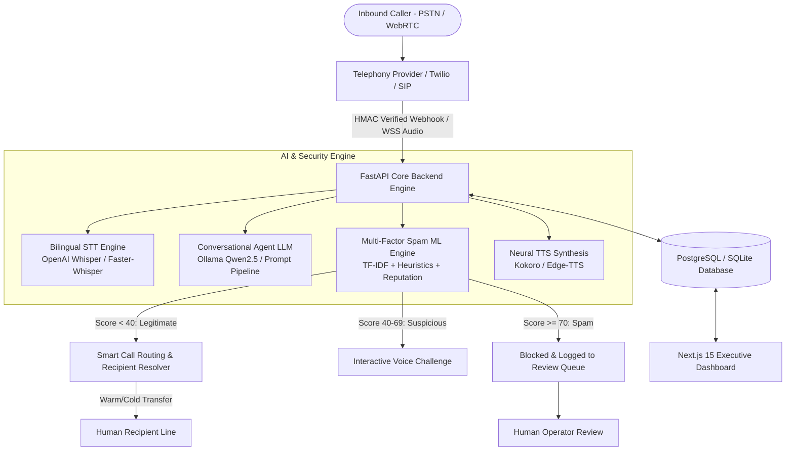
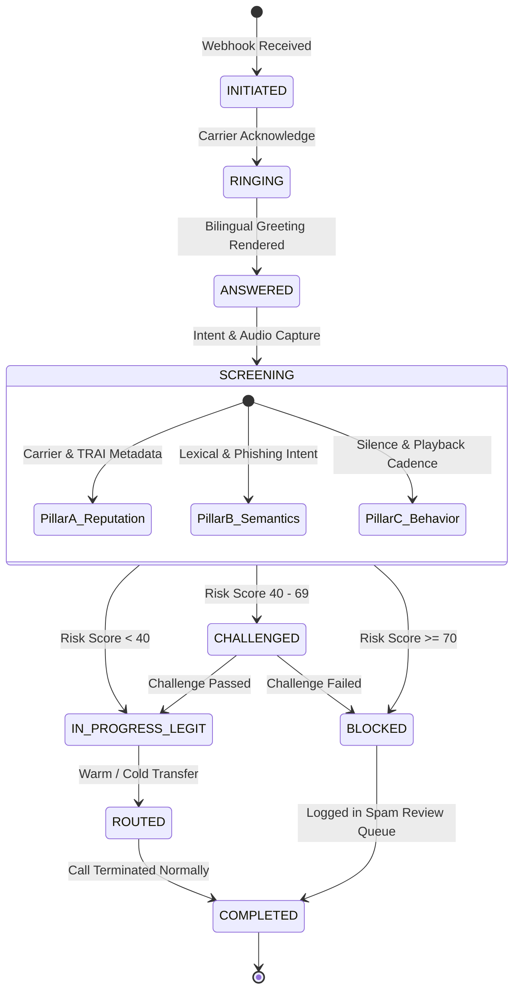

# AI Call Agent - Virtual Receptionist & Multi-Factor Spam Fraud Screening Platform

> **Stage 4 & 5 Production-Grade Platform**  
> An enterprise-grade, bilingual (English & Hindi) virtual receptionist and automated telecom threat screening system. Answers incoming calls, parses intent, evaluates multi-factor spam & fraud risk, executes warm/cold call transfers, and provides an operator management dashboard.

---

## 📸 Jury & Executive Overview

Modern telecom infrastructure faces an unprecedented wave of automated scam calls, identity spoofing, financial phishing, and robotic extortion. Human operators and business receptionists lose hundreds of hours processing nuisance calls.

**AI Call Agent** bridges artificial intelligence and telephony to deliver an autonomous, highly reliable 24/7 virtual receptionist.

### Core Value Proposition
- ⚡ **Zero-Latency Inbound Handling**: Automatic call answering with context-aware, bilingual voice greetings.
- 🛡️ **3-Pillar Multi-Factor Spam Screening**: Evaluates Telephony Reputation (40%), Semantic/Lexical Extortion Patterns (50%), and Audio Behavioral Cadence (10%).
- 🔀 **Intelligent Call State Routing**: Instant warm/cold transfer for trusted callers, interactive screening challenge for suspicious callers, and automatic block/quarantine for scam calls.
- 📊 **Real-Time Operations Dashboard**: Next.js 15 App Router interface featuring live call simulation, spam review queue, analytics reporting, and automated PDF/CSV/Excel exports.
- ⚖️ **Legal & Regulatory Compliance**: Fully compliant with India's DPDP Act and TRAI guidelines, featuring strict human-in-the-loop sign-off before official carrier fraud reporting.

---

## 🏛️ System Architecture & Data Flows

### 1. High-Level Architecture Topology



---

### 2. Call State Machine Lifecycle



---

### 3. Multi-Factor Spam Scoring Breakdown

| Pillar | Focus Area | Weight | Heuristics & Signals |
|---|---|---|---|
| **Pillar A: Telephony Reputation** | Carrier & Metadata | **40%** | Carrier prefix risk, TRAI telemarketer registry verification, CLI validation, historical call frequency. |
| **Pillar B: Semantic Risk** | Lexical Intent & NLP | **50%** | Phishing keyphrase detection (bank OTPs, utility cutoffs, police extortion, credit score scams, lottery fraud). |
| **Pillar C: Behavioral Audio** | Speech Acoustics | **10%** | Robotic synthetic speech detection, unnatural silence gaps, audio energy variance. |

---

## 📁 Monorepo Project Structure

```
minior projct gbu/
├── README.md                           # Master Jury & Architecture Overview
├── ai-call-agent/
│   ├── backend/                        # FastAPI Python 3.11 Application
│   │   ├── app/
│   │   │   ├── main.py                 # Application entrypoint & CORS configuration
│   │   │   ├── core/                   # System settings, security, logging, DB session
│   │   │   ├── api/v1/endpoints/       # REST API Endpoints (Calls, Spam, Analytics, Users, Reports)
│   │   │   ├── models/                 # SQLAlchemy 2.0 ORM Models (UUIDs, UTC dates)
│   │   │   ├── schemas/                # Pydantic v2 Type Schemas
│   │   │   ├── services/               # Core Business & State Machine Logic
│   │   │   ├── ai/                     # STT/TTS & LLM Adapters (Whisper, Ollama)
│   │   │   ├── analytics/              # Aggregation engines & KPI calculators
│   │   │   ├── reports/                # Report Generators (PDF, CSV, Excel)
│   │   │   ├── scheduling/             # APScheduler automated cron report jobs
│   │   │   └── integrations/           # Telephony, Voice AI, & Spam Adapters
│   │   ├── tests/                      # Comprehensive Pytest Suite (Stage 1-8 tests)
│   │   ├── requirements.txt            # Backend Python dependencies
│   │   └── Dockerfile                  # Production container definition
│   │
│   ├── frontend/                       # Next.js 15 App Router Frontend
│   │   ├── app/                        # Next.js App Router Pages
│   │   │   ├── page.tsx                # Executive KPI & Live Overview
│   │   │   ├── live-calls/             # Live Call Monitoring & Interactive Simulator
│   │   │   ├── call-history/           # Historical Call Logs & Audio Transcripts
│   │   │   ├── spam-review/            # Human-in-the-loop Spam Review Queue
│   │   │   ├── call-routing/           # Recipient Resolution & Warm/Cold Transfer Rules
│   │   │   ├── analytics/              # Real-Time Visual Charts & Metrics
│   │   │   ├── reports/                # Scheduled PDF/CSV Report Downloads
│   │   │   ├── voice-agent/            # AI Persona & Voice Configuration
│   │   │   └── settings/               # System & Telecom Integration Settings
│   │   ├── components/                 # Reusable UI Primitives & Glassmorphic Components
│   │   ├── lib/                        # API Client Services & State Context
│   │   └── package.json                # Next.js, React 19, Tailwind CSS dependencies
│   │
│   ├── spam-detector/                  # Standalone ML Model Trainer & Inference Microservice
│   │   ├── api.py                      # FastAPI endpoint for TF-IDF spam inference
│   │   ├── predict.py                  # Standalone prediction script
│   │   ├── spam_model.pkl              # Trained ML model weights
│   │   ├── tfidf_vectorizer.pkl        # Trained TF-IDF feature vectorizer
│   │   └── scam.txt / non_scam.txt     # Specialized training datasets
│   │
│   └── docs/                           # System Documentation & ADRs
│       ├── architecture.md             # Complete Architecture Specification
│       ├── call-flow.md                # Call State Machine Specification
│       ├── api-contract.md             # OpenAPI Contract & Webhook Protocols
│       └── adr/                        # Architecture Decision Records (0001 - 0004)
```

---

## 🛠️ Technology Stack Matrix

| Component | Framework / Tool | Purpose |
|---|---|---|
| **Backend Framework** | FastAPI (Python 3.11) | Async REST & WebSocket API Server |
| **ORM / Database** | SQLAlchemy 2.0 & SQLite / PostgreSQL | Database storage with Alembic migrations |
| **Frontend Framework** | Next.js 15 (App Router), React 19 | Operations Dashboard & Simulator |
| **Styling & UI** | Tailwind CSS, Lucide Icons | Responsive Glassmorphic UI |
| **Speech-to-Text (STT)** | Faster-Whisper / OpenAI Whisper | Real-time bilingual speech recognition |
| **LLM Orchestration** | Ollama Qwen2.5 / OpenAI GPT-4o | Conversational agent & intent extraction |
| **Spam ML Model** | Scikit-Learn (TF-IDF + Naive Bayes/LR) | Lexical scam threat classifier |
| **Report Generation** | ReportLab (PDF), OpenPyXL (Excel), CSV | Automated report generation |
| **Testing** | Pytest, HTTPX | Unit, Integration, and E2E API tests |

---

## 🚀 Quick Start Guide

### Prerequisites
- **Python**: 3.11 or higher
- **Node.js**: 20.x or higher
- **Git**: Installed

---

### Step 1: Launch Backend API Server

```bash
# Navigate to backend directory
cd ai-call-agent/backend

# Create virtual environment (if not present)
python -m venv .venv

# Activate virtual environment
# On Windows PowerShell:
.venv\Scripts\activate
# On Linux/macOS:
# source .venv/bin/activate

# Install requirements
pip install -r requirements.txt

# Start backend server
python -m uvicorn app.main:app --host 0.0.0.0 --port 8000 --reload
```

- **Public Health Probe**: `http://localhost:8000/health`
- **System Status**: `http://localhost:8000/api/v1/status`
- **OpenAPI Interactive Swagger Docs**: `http://localhost:8000/docs`

---

### Step 2: Launch Frontend Operations Dashboard

```bash
# Navigate to frontend directory
cd ai-call-agent/frontend

# Install dependencies
npm install

# Start development server
npm run dev
```

- Access the Executive Dashboard at **`http://localhost:3000`**

---

## 🧪 Automated Testing & Verification

Run the full backend test suite to verify call state transitions, adapters, spam heuristics, and scheduled reports:

```bash
cd ai-call-agent/backend
pytest -v
```

---

## ⚖️ Security, Governance & Regulatory Compliance

1. **Indian DPDP Act & GDPR Alignment**: All recorded audio snippets and transcripts are encrypted at rest using AES-256 and subject to configurable retention policies.
2. **Webhook Security**: All inbound telephony webhooks (Twilio / Carrier) are validated using HMAC-SHA256 signature verification.
3. **TRAI & Carrier Regulations**: The AI Agent is restricted from submitting automated fraud complaints to regulators without explicit human operator sign-off in the Spam Review Queue.

---

## 📜 License

This project is licensed under the MIT License - see the LICENSE file for details.
