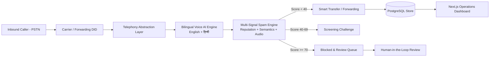

# AI Call Agent - Production Virtual Receptionist & Spam Screening Platform

> **Stage 1: Planning & System Architecture Foundation**  
> A production-oriented virtual receptionist that answers telephone calls in English & Hindi, extracts caller intent, evaluates multi-signal spam/fraud risk, safely forwards legitimate calls to human recipients, and provides an operator dashboard.

---

## 1. System Architecture & Core Flows



### Call State Transition Lifecycle
1. **PSTN Ingress**: Telephony provider webhook verified via HMAC-SHA256 signature.
2. **Dual-Language Greeting**: Polite bilingual greeting (`"Hello, thank you for calling... (नमस्ते, मैं आपकी क्या सहायता कर सकता हूँ?)"`).
3. **Intent Extraction**: Continuous acoustic and lexical parsing of caller identity, entity, and request.
4. **Three-Pillar Spam Scoring**:
   - **Pillar A: Reputation & Telephony Metadata (40%)**: Carrier prefix, TRAI telemarketer registration, CLI validation.
   - **Pillar B: Conversation Semantics (50%)**: Lexical detection of social engineering scripts (bank OTPs, utility cutoffs, police extortion).
   - **Pillar C: Behavioral Audio Signals (10%)**: Robotic playback cadence, unnatural silence.
5. **Decisive Routing**:
   - `0 - 39` -> **Legitimate**: Immediate warm/cold transfer to target recipient E.164 line.
   - `40 - 69` -> **Uncertain**: Interactive screening challenge before routing.
   - `70 - 100` -> **Spam**: Call politely terminated; logged in Human Spam Review queue.
6. **Governance & Legal Guardrail**: The automated AI is strictly prohibited from autonomously filing official fraud reports with regulators (TRAI / DoT). Human operator review and explicit sign-off is mandatory.

---

## 2. Monorepo Directory Structure

```
ai-call-agent/
├── backend/                        # FastAPI Python 3.11 Application
│   ├── app/
│   │   ├── main.py                 # App entrypoint, CORS, exception handlers
│   │   ├── core/                   # Config, logging, database sessions, exceptions
│   │   ├── api/v1/                 # Versioned REST & Webhook endpoints
│   │   ├── models/                 # SQLAlchemy 2.0 ORM models (UUIDs, UTC)
│   │   ├── schemas/                # Pydantic v2 schemas
│   │   ├── services/               # Call and Spam business logic
│   │   └── integrations/           # Decoupled abstraction layers
│   │       ├── telephony/          # TelephonyAdapter (Mock, Twilio stub)
│   │       ├── voice/              # VoiceAIAdapter (Mock bilingual)
│   │       └── spam/               # SpamDetectionAdapter (Multi-factor heuristics)
│   ├── alembic/                    # Database version migrations
│   ├── tests/                      # Pytest suite (Health, Status, Adapters, Models)
│   ├── requirements.txt            # Python dependencies
│   ├── Dockerfile                  # Production container definition
│   └── .env.example                # Non-secret environment template
├── frontend/                       # Next.js 15 App Router Frontend
│   ├── app/                        # Pages: Overview, Live Calls, History, Spam, Analytics, Settings, Login
│   ├── components/                 # Reusable UI primitives, tables, KPI cards, simulator
│   ├── lib/                        # API client, Auth context, realistic mock data
│   ├── types/                      # TypeScript domain types
│   ├── package.json                # Next.js, React, Tailwind CSS
│   └── .env.example                # Frontend environment template
├── docs/                           # Architecture Specifications & ADRs
│   ├── architecture.md             # System architecture & Mermaid topology
│   ├── call-flow.md                # Call state machine & failure mitigation
│   ├── api-contract.md             # OpenAPI & Webhook schemas
│   ├── database-schema.md          # ERD, indexing & retention strategies
│   ├── security.md                 # Security, privacy notices, DPDP Act & HMAC
│   ├── deployment.md               # Render, Vercel & Neon runbook
│   └── adr/                        # Architecture Decision Records (0001 - 0004)
├── .github/workflows/              # GitHub Actions CI workflow
├── docker-compose.yml              # Local PostgreSQL 16 & Backend services
├── render.yaml                     # Render deployment blueprint
├── .gitignore                      # Monorepo exclusions
└── README.md                       # Master documentation
```

---

## 3. Prerequisites & Environment Setup

- **Python**: 3.11 or higher
- **Node.js**: 20.x or higher
- **Docker & Docker Compose**: Optional for containerized database

---

## 4. Quick Start (Local Development)

### 4.1. Backend Setup

```bash
cd ai-call-agent/backend

# 1. Create virtual environment
python -m venv .venv
# Windows:
.venv\Scripts\activate
# Linux/macOS:
# source .venv/bin/activate

# 2. Install dependencies
pip install -r requirements.txt

# 3. Configure environment
cp .env.example .env

# 4. Start backend server
python -m uvicorn app.main:app --host 0.0.0.0 --port 8000 --reload
```

The backend is live at `http://localhost:8000`:
- Public Health Probe: `http://localhost:8000/health`
- System Status & Adapters: `http://localhost:8000/api/v1/status`
- OpenAPI Swagger Docs: `http://localhost:8000/docs`

### 4.2. Frontend Setup

```bash
cd ai-call-agent/frontend

# 1. Install dependencies
npm install

# 2. Configure environment
cp .env.example .env.local

# 3. Start development server
npm run dev
```

The dashboard will open at `http://localhost:3000`.

### 4.3. PostgreSQL with Docker Compose (Optional)

```bash
cd ai-call-agent
docker compose up -d postgres

# Run database migrations:
cd backend
.venv\Scripts\alembic upgrade head
```

---

## 5. Automated Testing & Quality Checks

Run all automated smoke and unit tests:

```bash
# Backend Pytest Suite
cd ai-call-agent/backend
python -m pytest -v

# Backend Linting (Ruff)
ruff check app tests

# Frontend Lint & Production Build
cd ../frontend
npm run lint
npm run build
```

---

## 6. Personal Mobile Forwarding Notice

> **IMPORTANT**: Operating the virtual receptionist with an existing personal mobile number requires configuring conditional call forwarding via carrier MMI codes (e.g., `*67*<DID>#` when busy, `*61*<DID>#` when unanswered) or porting to a supported SIP DID. Verify regulatory telecom country support and Indian Know-Your-Customer (KYC) documentation requirements prior to provisioning live phone numbers.

---

## 7. Stage Status & Roadmap

| Feature / Milestone | Status | Notes |
|---|---|---|
| **System Architecture & Documentation** | Completed | Full specs in `/docs` and `/docs/adr` |
| **FastAPI Backend Foundation** | Completed | `/health`, `/status`, typed settings, logging |
| **SQLAlchemy 2.0 Schema & Alembic** | Completed | UUIDs, UTC timestamps, 12 core models |
| **Stage 2: Auth, Database & REST APIs** | Completed | Argon2id, JWT, RBAC, Call State Machine, Spam Review |
| **Stage 3: Real Telephony & Media Streams** | Completed | Twilio TwiML, WSS Audio Stream, Webhook Validation, Simulator |
| **Stage 4: Natural-Language AI Voice Agent**| Completed | Ollama Qwen2.5, Faster-Whisper, Voice Cloning, Barge-In |
| **Next.js Dashboard Integration** | Completed | Live Calls, Voice Agent Config, Browser Simulator, SSE |
| **Stage 5: Multi-Factor Spam ML & Fraud Engine**| Planned | Advanced acoustic & lexical fraud pattern scoring |
