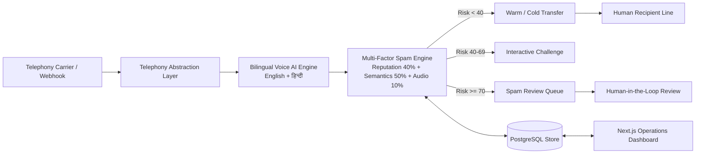

# AI Call Agent - Virtual Receptionist & Multi-Factor Spam Screening Platform

> **Stage 4 & 5 Monorepo Platform**  
> Complete implementation of the AI Virtual Receptionist, Telephony Abstraction Layer, Multi-Factor Spam Engine, Next.js Operations Dashboard, and Automated Reporting Infrastructure.

---

## 📌 Executive Architecture & Component Map



---

## 🛠️ Component Breakdown

- **[`backend/`](backend)**: FastAPI Python 3.11 web service with SQLAlchemy 2.0 ORM, Pydantic v2 schemas, Call state machine, STT/TTS adapters, and APScheduler report generation.
- **[`frontend/`](frontend)**: Next.js 15 App Router management dashboard with live call simulation, spam review queue, call routing configuration, and visual analytics.
- **[`spam-detector/`](spam-detector)**: Microservice and standalone ML trainer utilizing TF-IDF vectorization and Naive Bayes / Logistic Regression for scam intent classification.
- **[`docs/`](docs)**: Production architecture blueprints, call flow state machines, OpenAPI contracts, database ERD schemas, security compliance specs, and ADRs.

---

## 🚀 Quick Execution

### Start Backend
```bash
cd backend
.venv\Scripts\activate
python -m uvicorn app.main:app --host 0.0.0.0 --port 8000 --reload
```

### Start Frontend
```bash
cd frontend
npm run dev
```

### Run Pytest Suite
```bash
cd backend
pytest -v
```

For complete system details, refer to the master [`README.md`](../README.md) at the repository root.
