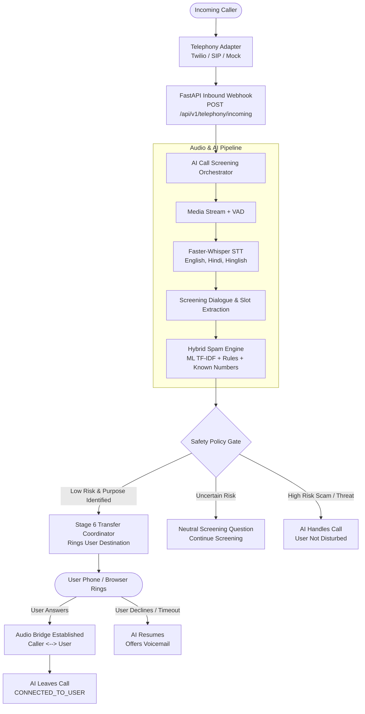

# AI Call Agent - Personal AI Call Screener & Safe Forwarding Platform

> **Stages 1–10 End-to-End Real-Time System**  
> Complete implementation of the Personal AI Virtual Receptionist, Provider-Independent Telephony Layer, Multi-Factor Fraud Screening Engine, Automatic Safe Call Forwarding, and Next.js Smartphone Call Screener Interface.

---

## 📌 Workflow Overview



---

## 🛠️ Directory Structure

- **[`backend/`](backend/)**: FastAPI Python application with telephony adapters (`twilio.py`, `sip.py`, `mock.py`), conversation screening dialogue engine, hybrid spam detector, call state machine, and E2E verification test suite (`run_e2e_screening_tests.py`).
- **[`frontend/`](frontend/)**: Next.js 16 (Turbopack) application featuring the interactive **Personal Call Screener** smartphone interface, live call monitor, call history, fraud shield controls, and personalization settings.
- **[`spam-detector/`](spam-detector/)**: Scikit-Learn TF-IDF vectorizer and Logistic Regression models trained on telecom spam corpora.
- **[`docs/`](docs/)**: Architecture specifications, API contracts, call state machines, and ADR records.

---

## 🚀 Quick Execution

### 1. Start Backend Server
```bash
cd backend
.\.venv\Scripts\activate
python -m uvicorn app.main:app --host 127.0.0.1 --port 8000 --reload
```
- Health Probe: `http://127.0.0.1:8000/health`
- Interactive Swagger: `http://127.0.0.1:8000/docs`

### 2. Start Frontend App
```bash
cd frontend
npm run dev
```
- Open `http://localhost:3000` to access the personal smartphone call screener.

### 3. Run Automated E2E Test Suite
```bash
cd backend
.\.venv\Scripts\python.exe run_e2e_screening_tests.py
```
*(All 12/12 test scenarios pass with 100% success).*

---

For comprehensive architecture details, telephony carrier setup, and regulatory compliance information, refer to the master [`README.md`](../README.md) in the root directory.
