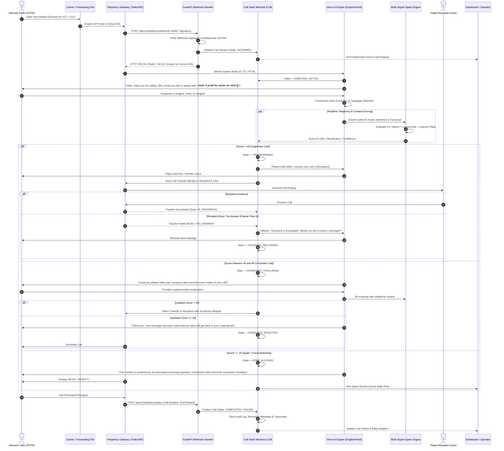

# AI Call Agent - Call Flow & State Machine Specification

## 1. Overview

This document specifies the end-to-end lifecycle of telephone calls received by the AI Virtual Receptionist. It defines call state transitions, audio streaming handoffs, intent extraction, bilingual dialogue management, spam risk classification, call forwarding mechanisms, completion hooks, and comprehensive failure recovery paths.

---

## 2. Complete Call Lifecycle Sequence Diagram

---

## 3. Detailed Step-by-Step Flow Breakdown

### Flow 1: Incoming Call -> Telephony Webhook -> Call Session
1. **PSTN Entry**: Caller dials either the direct virtual receptionist number or user's forwarded mobile.
2. **Webhook Ingestion**: Telephony provider sends an HTTP POST payload with caller E.164 (`From`), recipient DID (`To`), Call SID, Timestamp, and signature header (e.g., `X-Twilio-Signature`).
3. **Validation & Deduplication**:
   - Signature checked against provider signing secret.
   - Redis key `call:dedup:<call_sid>` checked with 60-second TTL to avoid duplicate webhook processing.
4. **Session Instantiation**: Record inserted into `calls` and `call_events` tables with state `INITIATED`.
5. **Initial Telephony Command**: Answering instruction returned within 800ms.

### Flow 2: Voice AI Greeting & Intent Extraction
1. **Bilingual Greeting**:
   - Primary: *"Hello, thank you for reaching out. How may I direct your call?"*
   - Bilingual Secondary: *"नमस्ते, मैं आपकी क्या सहायता कर सकता हूँ?"*
2. **Language Detection**:
   - Automatic identification of English, Hindi, or mixed Hinglish within the first 1.5 seconds of caller speech.
   - Dynamic prompt injection adapting tone and vocabulary to the caller's detected language.
3. **Slot Filling**:
   - `caller_name`: Identity claimed by caller.
   - `organization`: Company or entity represented.
   - `target_contact`: Specific team member or department requested.
   - `call_reason`: Brief synopsis of purpose.

### Flow 3: Number Reputation + Conversation Analysis + Behavioral Signals
1. **Reputation Lookup**:
   - Checked against internal historical spam list, Do-Not-Disturb (DND) scrub status, and telecom carrier CNAM reputation.
2. **Real-time Conversation Analysis**:
   - Regex/Embedding screening for high-frequency fraud keywords (e.g., *"KYC expired"*, *"electricity bill overdue"*, *"arrest warrant"*, *"customs package held"*, *"free loan approval"*).
3. **Behavioral Diagnostics**:
   - Detection of pre-recorded audio blasts (robocalls) vs live human turn-taking.

### Flow 4: Branching Decision Tree
- **Score < 40 (Legitimate)**: Initiates SIP REFER / call forwarding bridge to target destination.
- **Score 40-69 (Uncertain)**: Executes conversational screening challenge ("Could you please verify your reference number?").
- **Score >= 70 (Spam/Fraud)**: Hangs up politely or redirects to screening sandbox. Call flagged for human review.

### Flow 5: Call Completion, Database Commit & Operational Dashboard
1. Final duration, talk time, and disposition calculated.
2. Post-call processing creates `calls`, `spam_assessments`, `call_events`, and `transfers` records.
3. Call summary and action item generated via LLM.
4. Real-time dashboard updated via Server-Sent Events / WebSockets.

---

## 4. Failure Scenarios & Self-Healing Resilience

| Scenario | Symptom / Trigger | System Mitigation & Recovery | Fallback State |
|---|---|---|---|
| **Fail 1: AI Engine Unavailable** | WebSocket connection to Realtime AI fails or times out (>1200ms). | Immediately bypass AI. Fall back to classic IVR audio prompt: *"Thank you for calling. Please hold while we connect you."* Warm transfer directly to default receptionist line. | `AI_FALLBACK_FORWARDED` |
| **Fail 2: Forwarding Transfer Failed** | Target recipient line is busy, unreachable, or returns SIP 486/503. | Catch transfer webhook error event. Telephony adapter plays courteous response: *"The person you are trying to reach is currently unavailable. Please leave a brief message after the beep."* Ingest voicemail audio. | `TRANSFER_FAILED_VOICEMAIL` |
| **Fail 3: Caller Abrupt Hangup** | Caller disconnects during greeting or intent extraction (< 5 seconds). | Record call as `ABANDONED_EARLY`. Store caller ID and partial audio. If flagged with suspicious reputation, mark as potential robocall ping. | `CALLER_HUNG_UP` |
| **Fail 4: Duplicate Webhooks** | Telecom carrier retries webhook due to network jitter or delayed 200 OK. | Idempotency lock via `CallSid`. If call already exists in active/completed state, return cached response or empty 200 OK without re-spawning call pipeline. | `DUPLICATE_IGNORED` |
| **Fail 5: No Voice / Audio Silence** | Caller connects but maintains absolute silence for > 5 seconds. | Voice AI prompts once: *"Hello? Are you there?"* If silence persists for another 4 seconds, prompt: *"We are unable to hear you. Please call back again. Goodbye."* and terminate. | `SILENCE_TERMINATED` |
| **Fail 6: Ambiguous / Mumbled Audio** | Audio transcription confidence < 0.40. | AI politely requests repetition: *"I apologize, I didn't quite catch that. Could you please repeat your name?"* Maximum 2 retry turns before transferring to general inbox. | `LOW_CONFIDENCE_FALLBACK` |
