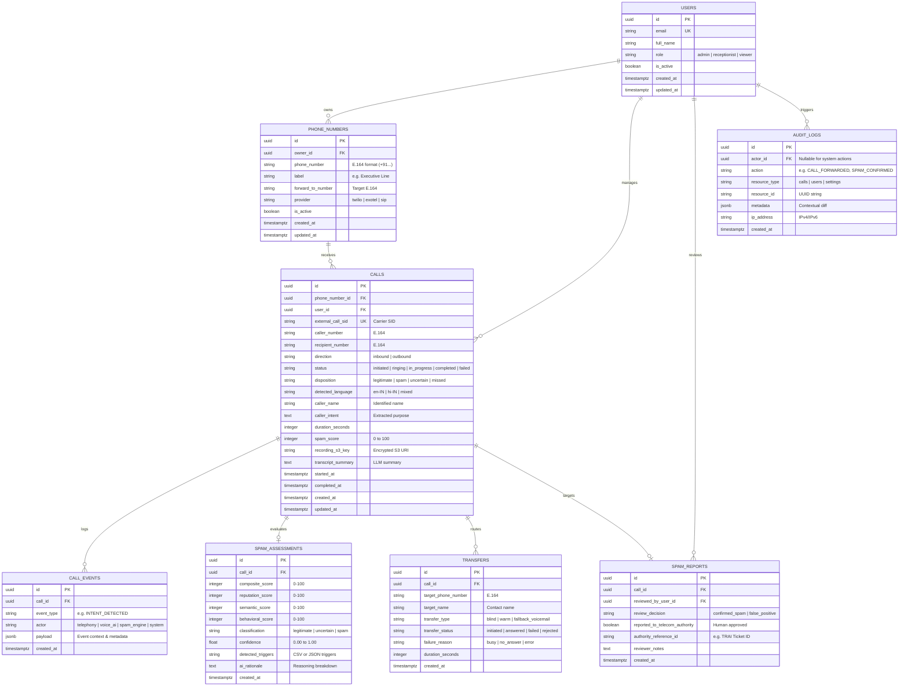

# AI Call Agent - Database Schema Specification

## 1. Overview & Architectural Principles

The AI Call Agent relational persistence layer is implemented in **PostgreSQL 16+** using **SQLAlchemy 2.0** ORM and versioned via **Alembic** migrations.

### Core Principles
1. **Immutable UUID Primary Keys**: Every table uses a RFC 4122 standard UUIDv4 primary key (`UUID(as_uuid=True)` in PostgreSQL) to prevent sequential enumeration attacks and facilitate distributed multi-region replication.
2. **UTC Timestamps Everywhere**: All timestamp columns (`created_at`, `updated_at`, `started_at`, `ended_at`) are stored with time zone in UTC (`TIMESTAMPTZ`).
3. **Multi-Tenant Ownership**: Core business resources (`phone_numbers`, `calls`, `transfers`) are partitioned by tenant/owner `user_id`.
4. **Light Event-Sourcing**: The `call_events` table maintains an append-only sequence of immutable events (`ringing`, `answered`, `greeting_played`, `intent_detected`, `spam_evaluated`, `transfer_initiated`, `completed`, `failed`).
5. **No Direct Audio in Database**: Raw voice call recordings and large binary audio blobs are **never** stored in PostgreSQL. They are stored in private, encrypted S3 buckets with time-limited signed URLs, and only object metadata/pointers are stored in the database.

---

## 2. Entity-Relationship Diagram (ERD)

---

## 3. Table Definitions, Constraints & Indexes

### 3.1. `users`
- Primary Key: `id UUID DEFAULT gen_random_uuid()`
- Indexes: `CREATE UNIQUE INDEX ix_users_email ON users(email);`
- Constraints: `role IN ('admin', 'receptionist', 'viewer')`

### 3.2. `phone_numbers`
- Primary Key: `id UUID DEFAULT gen_random_uuid()`
- Foreign Keys: `owner_id -> users(id) ON DELETE CASCADE`
- Indexes: `CREATE INDEX ix_phone_numbers_owner ON phone_numbers(owner_id);`
- Format: Enforces strict E.164 format (e.g. `+911140001234`).

### 3.3. `calls`
- Primary Key: `id UUID DEFAULT gen_random_uuid()`
- Foreign Keys:
  - `phone_number_id -> phone_numbers(id) ON DELETE SET NULL`
  - `user_id -> users(id) ON DELETE CASCADE`
- Indexes:
  - `CREATE UNIQUE INDEX ix_calls_external_sid ON calls(external_call_sid);`
  - `CREATE INDEX ix_calls_caller_number ON calls(caller_number);`
  - `CREATE INDEX ix_calls_status_disposition ON calls(status, disposition);`
  - `CREATE INDEX ix_calls_created_at ON calls(created_at DESC);`

### 3.4. `call_events`
- Primary Key: `id UUID DEFAULT gen_random_uuid()`
- Foreign Keys: `call_id -> calls(id) ON DELETE CASCADE`
- Indexes:
  - `CREATE INDEX ix_call_events_call_id ON call_events(call_id);`
  - `CREATE INDEX ix_call_events_created_at ON call_events(created_at);`

### 3.5. `spam_assessments`
- Primary Key: `id UUID DEFAULT gen_random_uuid()`
- Foreign Keys: `call_id -> calls(id) ON DELETE CASCADE UNIQUE`
- Indexes: `CREATE INDEX ix_spam_assessments_score ON spam_assessments(composite_score);`

### 3.6. `transfers`
- Primary Key: `id UUID DEFAULT gen_random_uuid()`
- Foreign Keys: `call_id -> calls(id) ON DELETE CASCADE`

### 3.7. `spam_reports`
- Primary Key: `id UUID DEFAULT gen_random_uuid()`
- Foreign Keys:
  - `call_id -> calls(id) ON DELETE CASCADE UNIQUE`
  - `reviewed_by_user_id -> users(id) ON DELETE RESTRICT`

### 3.8. `audit_logs`
- Primary Key: `id UUID DEFAULT gen_random_uuid()`
- Foreign Keys: `actor_id -> users(id) ON DELETE SET NULL`
- Indexes:
  - `CREATE INDEX ix_audit_logs_resource ON audit_logs(resource_type, resource_id);`
  - `CREATE INDEX ix_audit_logs_created_at ON audit_logs(created_at DESC);`

---

## 4. Retention & Data Minimization Strategy

1. **Active Operational Tier (0 - 90 Days)**: All call records, events, transcripts, and metadata remain in PostgreSQL. Audio recordings retained in primary S3 bucket.
2. **Archival Tier (91 - 365 Days)**:
   - Call audio files transitioned to S3 Glacier Flexible Retrieval or permanently purged based on user retention preferences.
   - Call events consolidated; detailed raw audio transcripts anonymized.
3. **Hard Deletion / Right to Erasure**:
   - Immediate purging of caller PII upon verified Right to Erasure request under DPDP Act / GDPR.
   - Deletion of `caller_number`, `caller_name`, and audio recording S3 artifacts, retaining an anonymized hash (`SHA-256(salt + caller_number)`) solely for spam telemetry.
