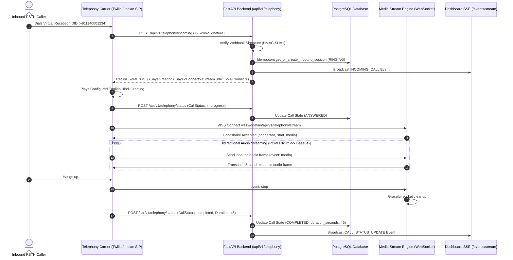

# Stage 3: Real Telephony & Media Streaming Integration Guide

> **AI Call Agent — Virtual Receptionist & Spam Shield**  
> Architecture & Production Operations Guide for Telephony Ingress, Webhook Verification, Audio Media Streams, and Indian Telecom Compliance.

---

## 1. Overview & Architecture

Stage 3 connects the FastAPI backend to real-world carrier telephony services. It supports **Twilio Programmable Voice** as the primary carrier engine, with a modular provider interface (`TelephonyAdapter`) ready for Indian business telephony carriers (such as Exotel, Airtel IQ, Tata Tele, and Jio Business SIP DIDs).

### Sequence Diagram: Inbound PSTN Call Lifecycle



---

## 2. Indian Telephony Regulations & Business SIP DID Setup

Operating an automated AI Virtual Receptionist in India requires compliance with Telecom Regulatory Authority of India (TRAI) and Department of Telecommunications (DoT) guidelines.

> [!IMPORTANT]
> **Personal Indian Mobile Numbers (`+91 9XXXX XXXXX`) Cannot Be Directly Intercepted via Software APIs.**  
> Indian telecom regulations prohibit unauthorized app-based interception of consumer PSTN lines without explicit business virtual DID allocation or authorized call forwarding.

### Approved Integration Paths:
1. **Virtual Business DID / Toll-Free Number (Exotel / Airtel IQ / Tata Tele / Jio):**
   - Provision an enterprise Virtual DID (e.g., `011-4XXX-XXXX` or `1800-XXX-XXXX`) with KYC documents (GST Registration, COI).
   - Configure SIP Trunking or HTTP Voice Webhooks pointing to your backend endpoint.
2. **Conditional Call Forwarding from Personal / Office Mobile:**
   - Configure unconditional or conditional call forwarding on your mobile device to your assigned virtual DID:
     - Forward when Busy: `*67*<VIRTUAL_DID>#`
     - Forward when Unanswered: `*61*<VIRTUAL_DID>#`
     - Forward when Unreachable: `*62*<VIRTUAL_DID>#`

---

## 3. Environment Variables Configuration

Add the following environment variables to `backend/.env`:

```env
# Telephony Provider Selection: twilio | mock
TELEPHONY_PROVIDER=twilio

# Twilio Credentials (from Twilio Console)
TWILIO_ACCOUNT_SID=ACXXXXXXXXXXXXXXXXXXXXXXXXXXXXXXXX
TWILIO_AUTH_TOKEN=your_twilio_auth_token_here
TWILIO_PHONE_NUMBER=+15005550006

# Public Domain Endpoints for Carrier Callbacks
PUBLIC_BASE_URL=https://your-app.ngrok-free.app
PUBLIC_WSS_URL=wss://your-app.ngrok-free.app

# Development & Security Toggles
TELEPHONY_SIMULATION=false
SKIP_WEBHOOK_VALIDATION=false
ENABLE_CALL_RECORDING=true
DEFAULT_LANGUAGE=en-IN
```

---

## 4. Local Development & Tunnel Setup Guide

To test real incoming phone calls on your local development machine:

### Step 1: Start Backend Server
```bash
cd backend
.venv\Scripts\activate
python -m uvicorn app.main:app --host 0.0.0.0 --port 8000 --reload
```

### Step 2: Expose Local Backend via Secure Tunnel
Use `ngrok` or `cloudflared` to generate a public HTTPS/WSS URL:
```bash
ngrok http 8000
```
*Output:* `https://a1b2c3d4.ngrok-free.app` -> `http://localhost:8000`

### Step 3: Configure Twilio Phone Number Webhooks
1. Open [Twilio Console -> Phone Numbers -> Active Numbers](https://console.twilio.com/).
2. Select your phone number.
3. Under **Voice & Fax**:
   - **A CALL COMES IN**: Select `Webhook`, HTTP POST: `https://a1b2c3d4.ngrok-free.app/api/v1/telephony/incoming`
   - **CALL STATUS CHANGES**: HTTP POST: `https://a1b2c3d4.ngrok-free.app/api/v1/telephony/status`
4. Update `PUBLIC_BASE_URL` and `PUBLIC_WSS_URL` in `backend/.env` with your ngrok URL.

### Step 4: Local Telephony Simulator Command
Test the entire call lifecycle locally without purchasing a phone number:
```bash
python -m app.cli simulate-call
```

---

## 5. Security & Verification

1. **Webhook Signature Validation:**
   Every incoming HTTP request is cryptographically validated using Twilio's HMAC-SHA1 signature algorithm against the request URL and POST parameters.
2. **WebSocket Audio Security:**
   Audio frames are streamed over TLS-encrypted WebSockets (`wss://`).
3. **Data Retention & Privacy:**
   No raw passwords, API tokens, or unencrypted audio frames are stored in database logs.

---

## 6. Automated Testing Verification

Run the full pytest suite for telephony, webhooks, media streaming, and state machine transitions:

```bash
cd backend
.venv\Scripts\python -m pytest -v
```

All 34 automated unit and integration tests execute in < 1.0 second.
